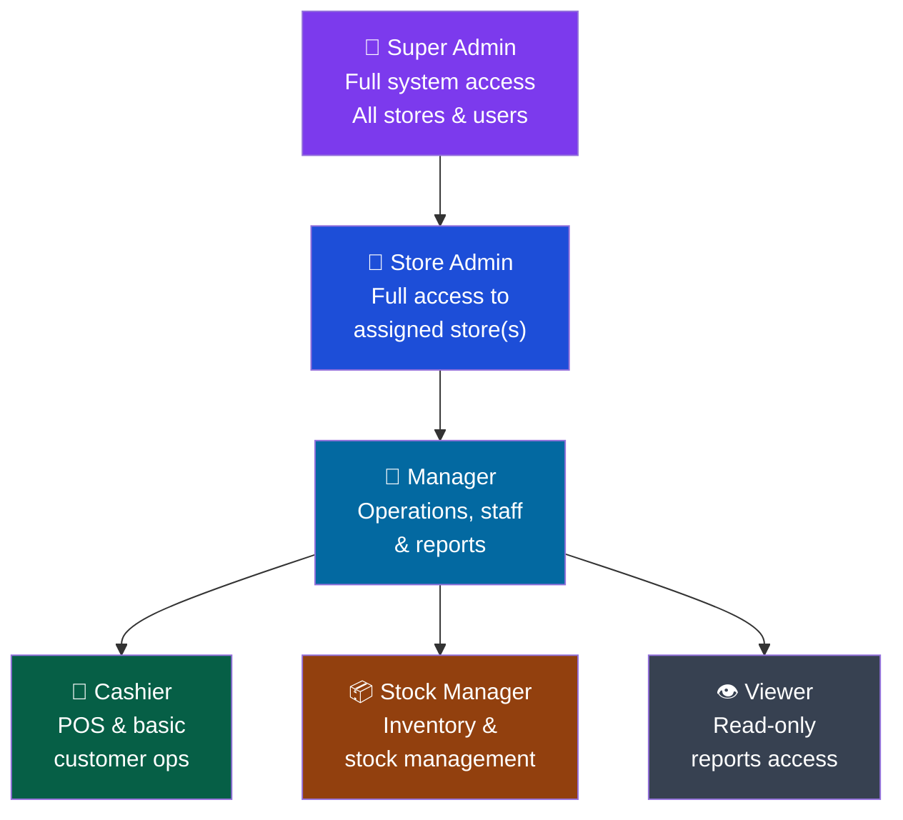
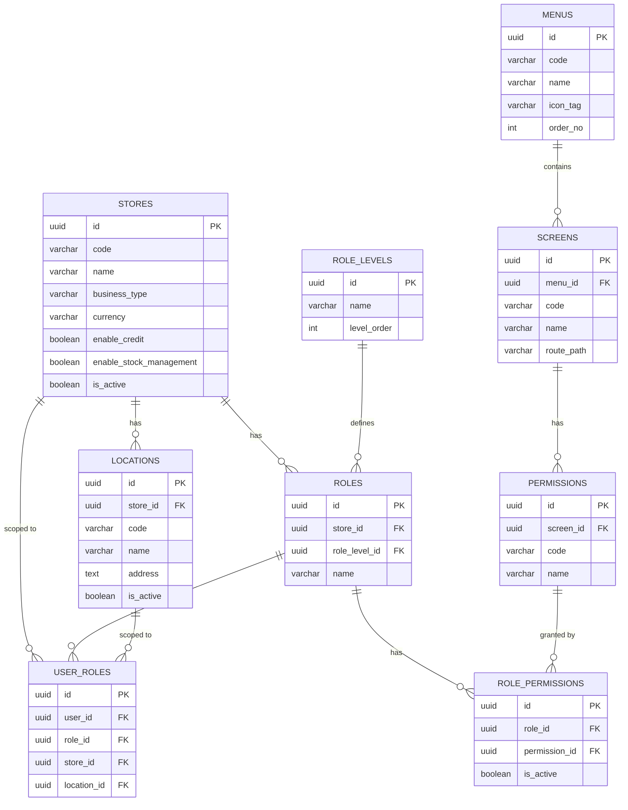
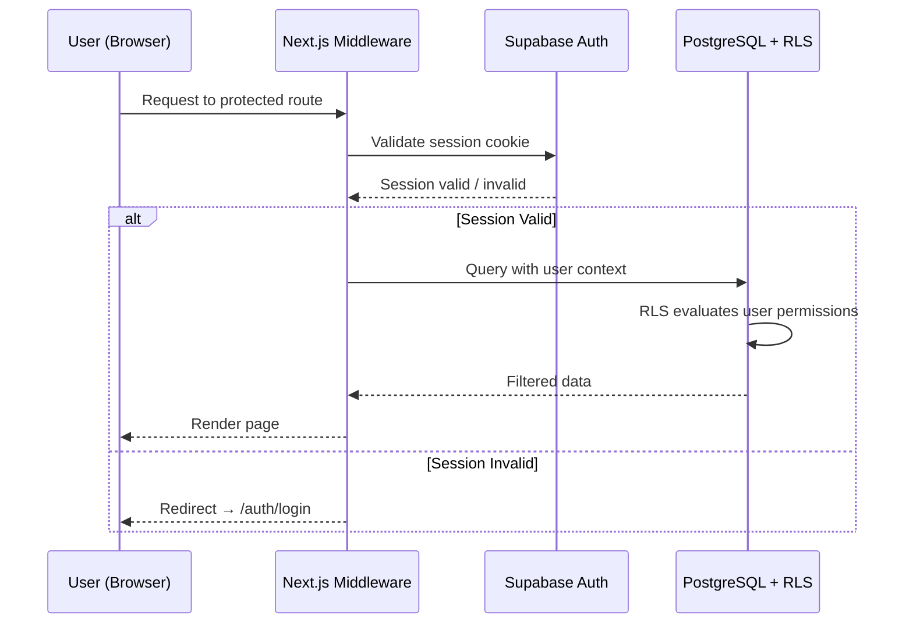
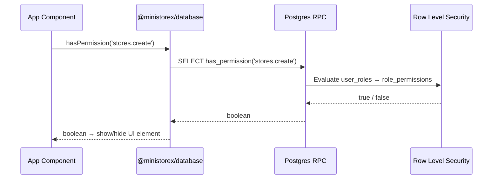

<div align="center">

```
███╗   ███╗██╗███╗   ██╗██╗    ███████╗████████╗ ██████╗ ██████╗ ███████╗██╗  ██╗
████╗ ████║██║████╗  ██║██║    ██╔════╝╚══██╔══╝██╔═══██╗██╔══██╗██╔════╝╚██╗██╔╝
██╔████╔██║██║██╔██╗ ██║██║    ███████╗   ██║   ██║   ██║██████╔╝█████╗   ╚███╔╝ 
██║╚██╔╝██║██║██║╚██╗██║██║    ╚════██║   ██║   ██║   ██║██╔══██╗██╔══╝   ██╔██╗ 
██║ ╚═╝ ██║██║██║ ╚████║██║    ███████║   ██║   ╚██████╔╝██║  ██║███████╗██╔╝ ██╗
╚═╝     ╚═╝╚═╝╚═╝  ╚═══╝╚═╝    ╚══════╝   ╚═╝    ╚═════╝ ╚═╝  ╚═╝╚══════╝╚═╝  ╚═╝
```

**Multi-Tenant Retail Management Platform**

*One platform. Multiple stores. Complete control.*

---

[](https://nextjs.org/)
[](https://react.dev/)
[](https://www.typescriptlang.org/)
[](https://supabase.com/)
[](https://turbo.build/)
[](https://pnpm.io/)
[](https://tailwindcss.com/)

</div>

---

## 📋 Table of Contents

- [Business Overview](#-business-overview)
- [Platform Architecture](#-platform-architecture)
- [Applications](#-applications)
- [Feature Modules](#-feature-modules)
- [Role & Permission System](#-role--permission-system)
- [Database Schema](#-database-schema)
- [Tech Stack](#-tech-stack)
- [Monorepo Structure](#-monorepo-structure)
- [Getting Started](#-getting-started)
- [Environment Variables](#-environment-variables)
- [Data Flow](#-data-flow)
- [Roadmap](#-roadmap)

---

## 🏪 Business Overview

MiniStoreX is a **cloud-based, multi-tenant retail management system** designed for small-to-medium retail businesses. It provides a unified platform that connects store owners, managers, cashiers, customers, and suppliers under one ecosystem.

### The Problem We Solve

| Pain Point | MiniStoreX Solution |
|---|---|
| Managing multiple store branches manually | Centralised multi-location dashboard with real-time data |
| No visibility into stock across locations | Unified inventory with stock in / out / adjustment tracking |
| Credit sales tracked in paper ledgers | Digital credit ("Naya") ledger with payment history |
| Manual daily reconciliation | Automated sales reports & daily summaries |
| One-size-fits-all user permissions | Granular role-based access control per screen |
| Supplier coordination fragmented | Dedicated supplier portal integrated into the ecosystem |

### Business Value Proposition

```
┌─────────────────────────────────────────────────────────────────┐
│                    MINISTOREX VALUE CHAIN                       │
├──────────────┬──────────────┬──────────────┬────────────────────┤
│  SUPPLIERS   │    STORES    │  CUSTOMERS   │      ADMINS        │
│              │              │              │                    │
│ • Submit     │ • POS Sales  │ • View       │ • Manage all       │
│   invoices   │ • Inventory  │   purchases  │   stores           │
│ • Track      │   management │ • Credit     │ • RBAC control     │
│   orders     │ • Staff      │   balance    │ • System-wide      │
│ • Manage     │   management │ • Order      │   reports          │
│   pricing    │ • Reports    │   history    │ • Audit logs       │
└──────────────┴──────────────┴──────────────┴────────────────────┘
```

---

## 🏗️ Platform Architecture

```mermaid
graph TB
    subgraph "Client Applications"
        A[🖥️ Admin Portal<br/>:3001]
        B[🏪 Store Web<br/>:3002]
        C[👤 Customer Web<br/>:3003]
        D[🚚 Supplier Portal<br/>:3004]
    end

    subgraph "Shared Packages"
        UI[@ministorex/ui<br/>Component Library]
        DB[@ministorex/database<br/>Supabase SDK]
        CFG[@ministorex/config<br/>Tailwind + TS]
        UTL[@ministorex/utils<br/>Helpers]
    end

    subgraph "Backend — Supabase"
        AUTH[Auth<br/>JWT + Sessions]
        PG[(PostgreSQL<br/>Database)]
        RLS[Row Level<br/>Security]
        RPC[Database<br/>Functions / RPC]
        RT[Realtime<br/>Subscriptions]
    end

    A --> UI
    A --> DB
    B --> UI
    B --> DB
    C --> UI
    C --> DB
    D --> UI
    D --> DB

    UI --> CFG
    DB --> CFG
    UTL --> CFG

    DB --> AUTH
    DB --> PG
    PG --> RLS
    PG --> RPC
    PG --> RT

    style A fill:#6366f1,color:#fff
    style B fill:#10b981,color:#fff
    style C fill:#f59e0b,color:#fff
    style D fill:#ef4444,color:#fff
    style PG fill:#3b82f6,color:#fff
    style AUTH fill:#8b5cf6,color:#fff
```

---

## 📱 Applications

### 🖥️ Admin Portal (`apps/admin-portal`) — Port 3001

The nerve centre of MiniStoreX. Full system administration with multi-store visibility.

**Key screens:**
- **Dashboard** — KPIs and summary metrics across all stores
- **Store Operations** — POS, sales history
- **Inventory** — Products, stock in/out, adjustments
- **Customers** — Customer profiles and ledger
- **Credit / Naya** — Credit sales management and payment tracking
- **Reports** — Daily, sales, stock, credit reports
- **Administration** — Stores, locations, users, roles & permissions, settings

### 🏪 Store Web (`apps/store-web`) — Port 3002

Lightweight storefront interface for in-store operations — optimised for cashier and floor staff workflows.

### 👤 Customer Web (`apps/customer-web`) — Port 3003

Customer-facing portal for viewing purchase history, outstanding credit balances, and account details.

### 🚚 Supplier Portal (`apps/supplier-portal`) — Port 3004

Supplier-facing portal for invoice submission, order tracking, and pricing management.

---

## ✨ Feature Modules

### Point of Sale (POS)

```
Customer arrives → Select products → Apply discounts → Choose payment
     │                                                        │
     └──────────────── Cash / Credit ("Naya") ───────────────┘
                                │
                    Update stock levels automatically
                    Record transaction in sales history
                    Generate receipt
```

### Inventory Management

| Action | Description |
|---|---|
| **Stock In** | Record received goods from suppliers |
| **Stock Out** | Record goods moved out (damaged, transferred) |
| **Adjustments** | Manual corrections to stock count |
| **Products** | Manage product catalog with pricing |

### Credit / Naya System

A digital ledger for the common retail practice of credit sales. Tracks outstanding balances per customer, records partial and full payments, and generates ageing reports.

### Multi-Location Support

```
Store A (Colombo HQ)
├── Location: Main Branch
├── Location: Ground Floor
└── Location: Warehouse

Store B (Kandy)
├── Location: Main Branch
└── Location: Express Counter
```

Each location has independent stock but rolls up to the store level for reporting.

---

## 🔐 Role & Permission System

MiniStoreX uses a **fine-grained RBAC system** where every screen has its own permission codes assigned to roles.

### Role Hierarchy



### Permission Matrix

| Module | Super Admin | Store Admin | Manager | Cashier | Stock Manager | Viewer |
|---|:---:|:---:|:---:|:---:|:---:|:---:|
| Dashboard | ✅ | ✅ | ✅ | ✅ | ✅ | ✅ |
| POS | ✅ | ✅ | ✅ | ✅ | ❌ | ❌ |
| Sales History | ✅ | ✅ | ✅ | 👁️ | ❌ | 👁️ |
| Products | ✅ | ✅ | ✅ | 👁️ | ✅ | 👁️ |
| Stock In / Out | ✅ | ✅ | ✅ | ❌ | ✅ | 👁️ |
| Customers | ✅ | ✅ | ✅ | ✅ | ❌ | 👁️ |
| Credit / Naya | ✅ | ✅ | ✅ | ✅ | ❌ | 👁️ |
| Reports | ✅ | ✅ | ✅ | ❌ | ❌ | ✅ |
| Admin: Stores | ✅ | 👁️ | ❌ | ❌ | ❌ | ❌ |
| Admin: Users | ✅ | ✅ | ❌ | ❌ | ❌ | ❌ |
| Admin: Roles | ✅ | ❌ | ❌ | ❌ | ❌ | ❌ |

> ✅ Full access &nbsp;&nbsp; 👁️ Read-only &nbsp;&nbsp; ❌ No access

Permissions are enforced at both the **database level** (PostgreSQL RLS + stored functions) and the **application level** (server-side session checks via Supabase SSR).

---

## 🗄️ Database Schema



### Security Model

All tables use **Row Level Security (RLS)**. Access is enforced by three Postgres stored functions called on every request:

```sql
has_permission(permission_code)   -- Does the user have this specific permission?
get_user_permissions()            -- Return all permissions for the current session
is_super_admin()                  -- Fast check for elevated access
```

---

## 🛠️ Tech Stack

### Core

| Layer | Technology | Purpose |
|---|---|---|
| **Framework** | Next.js 15 (App Router) | Full-stack React framework with SSR/RSC |
| **Language** | TypeScript 5 | Type safety across the entire monorepo |
| **Styling** | Tailwind CSS 3.4 | Utility-first CSS |
| **UI Primitives** | Radix UI | Accessible, unstyled headless components |
| **Icons** | Lucide React | Consistent icon set |
| **Animations** | Framer Motion 11 | Layout and transition animations |
| **Theming** | next-themes | Dark / light mode support |
| **Toasts** | Sonner | Notification system |

### Backend & Data

| Layer | Technology | Purpose |
|---|---|---|
| **Database** | PostgreSQL (via Supabase) | Primary data store |
| **Auth** | Supabase Auth | JWT-based authentication + session management |
| **ORM / Client** | `@supabase/supabase-js` | Typed, generated database client |
| **SSR Auth** | `@supabase/ssr` | Secure cookie-based sessions for Next.js |
| **Security** | Row Level Security (RLS) | Database-enforced access control |

### Monorepo Tooling

| Tool | Version | Purpose |
|---|---|---|
| **pnpm** | 9.15 | Fast, disk-efficient package manager |
| **Turborepo** | 2.3 | Incremental monorepo build system with caching |
| **Prettier** | 3.x | Code formatting |

---

## 📁 Monorepo Structure

```
ministorex-monorepo/
│
├── apps/                          # Deployable applications
│   ├── admin-portal/              # 🖥️  System admin dashboard (port 3001)
│   │   ├── app/                   # Next.js App Router pages
│   │   │   ├── auth/              # Login, signup, password reset
│   │   │   └── dashboard/         # Protected dashboard routes
│   │   └── components/            # App-specific components
│   │       ├── layout/            # Sidebar, header, dashboard shell
│   │       └── providers/         # Auth context provider
│   │
│   ├── store-web/                 # 🏪  In-store operations (port 3002)
│   ├── customer-web/              # 👤  Customer portal (port 3003)
│   └── supplier-portal/           # 🚚  Supplier portal (port 3004)
│
├── packages/                      # Shared internal packages
│   ├── database/                  # @ministorex/database
│   │   ├── src/
│   │   │   ├── client.ts          # Browser Supabase client
│   │   │   ├── server.ts          # Server-side Supabase client
│   │   │   ├── middleware.ts      # Session refresh middleware
│   │   │   ├── permissions.ts     # Permission check helpers
│   │   │   ├── api/
│   │   │   │   └── stores.ts      # Stores/Locations CRUD API
│   │   │   └── types/
│   │   │       └── database.ts    # Generated TypeScript types
│   │   └── supabase/
│   │       └── migrations/        # SQL migration files (001–006)
│   │
│   ├── ui/                        # @ministorex/ui
│   │   └── src/components/        # Shared Radix UI components
│   │       # Alert, Avatar, Badge, Button, Card, Checkbox,
│   │       # Dropdown, Input, Label, Progress, ScrollArea,
│   │       # Separator, Skeleton, Toaster, Tooltip
│   │
│   ├── config/                    # @ministorex/config
│   │   ├── tailwind.config.ts     # Shared Tailwind configuration
│   │   ├── tsconfig.base.json     # Base TypeScript config
│   │   └── tsconfig.nextjs.json   # Next.js TypeScript config
│   │
│   └── utils/                     # @ministorex/utils
│       └── src/
│           ├── format.ts          # Date, currency, string formatters
│           └── constants.ts       # Shared constants
│
├── package.json                   # Root workspace config
├── pnpm-workspace.yaml            # pnpm workspace definition
├── turbo.json                     # Turborepo pipeline config
└── .env.local                     # Root env (apps need their own)
```

---

## 🚀 Getting Started

### Prerequisites

- **Node.js** 18+
- **pnpm** 9.15+ — `npm install -g pnpm@9.15`
- A **Supabase** project — [supabase.com](https://supabase.com)

### 1. Clone & Install

```bash
git clone https://github.com/your-org/ministorex-monorepo.git
cd ministorex-monorepo
pnpm install
```

### 2. Set Up the Database

Run the migrations in order against your Supabase project via the Supabase SQL editor or CLI:

```bash
# Using Supabase CLI (supabase db push) or paste in SQL Editor:
001_create_stores_and_locations.sql
002_create_rbac_tables.sql
003_seed_initial_data.sql
004_create_super_admin.sql
005_add_stores_locations_screens.sql
006_fix_rls_recursion.sql
```

### 3. Configure Environment Variables

Each app needs its own `.env.local`. Copy the template into each app directory:

```bash
# Example — repeat for each app
cp .env.local apps/admin-portal/.env.local
cp .env.local apps/store-web/.env.local
cp .env.local apps/customer-web/.env.local
cp .env.local apps/supplier-portal/.env.local
```

Set the values from your Supabase project's **Settings → API** page:

```bash
NEXT_PUBLIC_SUPABASE_URL=https://<your-project>.supabase.co
NEXT_PUBLIC_SUPABASE_PUBLISHABLE_KEY=<your-anon-key>
```

### 4. Run in Development

```bash
# Start all apps simultaneously (with Turborepo dev pipeline)
pnpm dev

# Or run a single app
pnpm --filter @ministorex/admin-portal dev
```

| App | URL |
|---|---|
| Admin Portal | http://localhost:3001 |
| Store Web | http://localhost:3002 |
| Customer Web | http://localhost:3003 |
| Supplier Portal | http://localhost:3004 |

### 5. Build for Production

```bash
pnpm build
```

Turborepo will build packages in topological dependency order and cache results for subsequent builds.

---

## 🔑 Environment Variables

| Variable | Required | Description |
|---|:---:|---|
| `NEXT_PUBLIC_SUPABASE_URL` | ✅ | Your Supabase project URL |
| `NEXT_PUBLIC_SUPABASE_PUBLISHABLE_KEY` | ✅ | Your Supabase anon/public key |
| `VERCEL_URL` | ❌ | Auto-set on Vercel — used for metadata base URL |

> ⚠️ **Important:** Next.js only reads `.env.local` from each app's own directory. The root `.env.local` is for reference only — each `apps/*` folder must have its own copy.

---

## 🔄 Data Flow

### Authentication Flow



### Permission Check Flow



---

## 🗺️ Roadmap

### ✅ Phase 1 — Foundation (Complete)
- [x] Monorepo setup with Turborepo + pnpm
- [x] Shared UI component library
- [x] Supabase database layer with TypeScript types
- [x] Admin portal shell with authentication
- [x] RBAC database schema with RLS
- [x] Store & location management API
- [x] Role-based dashboard layout

### 🚧 Phase 2 — Core Operations (In Progress)
- [ ] POS (Point of Sale) interface
- [ ] Product catalogue management
- [ ] Stock in / out / adjustment flows
- [ ] Customer management
- [ ] Credit / Naya ledger

### 🔜 Phase 3 — Reporting & Analytics
- [ ] Daily sales summary
- [ ] Sales trend reports
- [ ] Stock level reports
- [ ] Credit ageing reports
- [ ] Export to PDF / Excel

### 🔜 Phase 4 — Customer & Supplier Portals
- [ ] Customer self-service portal
- [ ] Credit balance & payment history
- [ ] Supplier invoice submission
- [ ] Purchase order management

### 🔮 Phase 5 — Advanced Features
- [ ] Real-time dashboard (Supabase Realtime)
- [ ] Mobile PWA support
- [ ] Multi-currency support
- [ ] Offline POS mode
- [ ] SMS / WhatsApp notifications

---

## 🤝 Contributing

1. Fork the repo and create a feature branch: `git checkout -b feat/your-feature`
2. Make your changes and run `pnpm lint` + `pnpm build` to verify
3. Commit using conventional commits: `feat:`, `fix:`, `chore:` etc.
4. Open a Pull Request with a clear description

---

## 📜 License

Copyright (c) 2026 **Kaviska Dinajara**

This project is licensed under the **[PolyForm Noncommercial License 1.0.0](LICENSE)**.

**What this means:**

| ✅ Allowed | ❌ Not Allowed |
|---|---|
| Personal use & hobby projects | Commercial products or services |
| Educational & academic use | Selling or monetising the software |
| Research & experimentation | SaaS / subscription offerings using this code |
| Non-profit & government use | Sublicensing to others |
| Forking & modifying for personal use | Distributing without this license notice |

> 💼 **Commercial licensing available** — contact **Kaviska Dinajara** to obtain a commercial license for use in commercial products or services.

See the full license text in the [LICENSE](LICENSE) file.

---

<div align="center">

Copyright (c) 2026 Kaviska Dinajara &nbsp;·&nbsp; Built with ❤️ using **Next.js**, **Supabase**, and **Turborepo**

</div>
